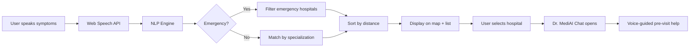

<p align="center">
  
</p>

<h1 align="center">PulsePoint Assist</h1>

<p align="center">
  <strong>AI-Powered Healthcare Facility Locator & Voice-Assisted Medical Booking System</strong>
</p>

<p align="center">
  <a href="https://pulsepoint-assist.vercel.app"></a>
</p>

<p align="center">
  
  
  
  
  
  
</p>

---

## 📋 Table of Contents

- [Overview](#-overview)
- [Key Features](#-key-features)
- [Architecture](#-architecture)
- [Tech Stack](#-tech-stack)
- [Getting Started](#-getting-started)
- [Project Structure](#-project-structure)
- [Data Coverage](#-data-coverage)
- [How It Works](#-how-it-works)
- [Deployment](#-deployment)
- [Contributing](#-contributing)
- [License](#-license)

---

## 🩺 Overview

**PulsePoint Assist** is an intelligent, voice-enabled healthcare facility locator designed to help users find the right hospital based on their symptoms, location, and medical needs. It combines a real-time interactive map with a built-in NLP symptom analyzer and an AI-powered voice chat assistant to guide users through pre-visit preparation.

Whether you're searching for a nearby cardiologist, need an emergency-ready hospital, or want voice-guided booking assistance — PulsePoint Assist handles it all from a single, clean interface.

---

## ✨ Key Features

### 🗺️ Interactive Map Interface
- Full-screen **Leaflet**-powered map with hospital markers across India
- Color-coded markers for matched vs. unmatched hospitals
- Live route visualization from user location to selected hospital
- Auto-zoom to fit relevant hospitals within the viewport

### 🎙️ Voice-Powered Symptom Analysis
- **Web Speech API** integration for hands-free voice input
- Real-time interim transcript display while speaking
- Spacebar shortcut for quick voice activation
- Text-to-speech response readback for accessibility

### 🧠 Built-In NLP Engine
- Keyword-based symptom-to-specialization mapping (15 specializations)
- Emergency keyword detection with automatic triage routing
- Intelligent hospital matching based on specialization + distance

### 🤖 Dr. MediAI — Voice Chat Assistant
- Interactive chat modal with contextual medical guidance
- Pre-visit instructions, cost estimates, and preparation advice
- Voice input/output within the chat for a conversational experience
- Contextually aware of the selected hospital and specialization

### 📍 Geolocation & Distance Sorting
- Automatic user geolocation via the browser's **Geolocation API**
- Haversine-formula distance calculation to every hospital
- Hospitals sorted by proximity for faster decision-making

### 🚨 Emergency Mode
- Automatic activation upon detecting emergency keywords
- Visual emergency banner with hospital recommendation
- Priority routing to the nearest emergency-ready facility

### 📊 Rich Hospital Profiles
- Detailed data: specializations, ratings, bed availability, doctor profiles
- Color-coded specialization badges
- Star ratings and distance indicators on every card

---

## 🏗️ Architecture

```
┌───────────────────────────────────────────────────────────────┐
│                        PulsePoint Assist                      │
├───────────────────────────────────────────────────────────────┤
│                                                               │
│  ┌──────────┐   ┌──────────┐   ┌──────────────────────────┐  │
│  │LeftPanel │   │ MapView  │   │      RightPanel          │  │
│  │          │   │(Leaflet) │   │  (Hospital List + Stats) │  │
│  │• State   │   │          │   │                          │  │
│  │• District│   │• Markers │   │  ┌──────────────┐       │  │
│  │• Voice   │   │• Routes  │   │  │HospitalCard  │ × N   │  │
│  │  Input   │   │• Popups  │   │  └──────────────┘       │  │
│  └──────────┘   └──────────┘   └──────────────────────────┘  │
│                                                               │
│  ┌────────────────────────────────────────────────────────┐   │
│  │                    Core Engine Layer                    │   │
│  │                                                        │   │
│  │  useVoice ──▶ nlpEngine ──▶ responseGenerator ──▶ TTS  │   │
│  │  useGeolocation ──▶ haversine ──▶ Distance Sorting     │   │
│  └────────────────────────────────────────────────────────┘   │
│                                                               │
│  ┌────────────────────────────────────────────────────────┐   │
│  │                    Data Layer                          │   │
│  │  hospitals.ts (150+ hospitals) │ symptomMap.ts │ ...   │   │
│  └────────────────────────────────────────────────────────┘   │
└───────────────────────────────────────────────────────────────┘
```

---

## 🛠️ Tech Stack

| Layer            | Technology                                                   |
| ---------------- | ------------------------------------------------------------ |
| **Framework**    | React 18 with TypeScript                                     |
| **Build Tool**   | Vite 5                                                       |
| **Styling**      | Tailwind CSS 3.4 + shadcn/ui components                      |
| **Map**          | Leaflet + React-Leaflet                                      |
| **Voice**        | Web Speech API (SpeechRecognition + SpeechSynthesis)          |
| **State**        | React hooks (`useState`, `useMemo`, `useCallback`, `useRef`) |
| **Data Fetching**| TanStack React Query                                         |
| **Routing**      | React Router DOM v6                                          |
| **Charts**       | Recharts                                                     |
| **Forms**        | React Hook Form + Zod validation                             |
| **Testing**      | Vitest + React Testing Library + Playwright                   |
| **Deployment**   | Vercel                                                       |

---

## 🚀 Getting Started

### Prerequisites

- **Node.js** ≥ 18.x
- **npm** ≥ 9.x (or yarn/pnpm/bun)

### Installation

```bash
# 1. Clone the repository
git clone https://github.com/ganesh2317/pulsepoint-assist.git

# 2. Navigate to the project directory
cd pulsepoint-assist

# 3. Install dependencies
npm install

# 4. Start the development server
npm run dev
```

The app will be available at **http://localhost:8080** (or the next available port).

### Available Scripts

| Command          | Description                                |
| ---------------- | ------------------------------------------ |
| `npm run dev`    | Start development server with HMR          |
| `npm run build`  | Create optimized production build           |
| `npm run preview`| Preview the production build locally        |
| `npm run lint`   | Run ESLint for code quality checks          |
| `npm run test`   | Run unit tests with Vitest                  |
| `npm run test:watch` | Run tests in watch mode                |

---

## 📁 Project Structure

```
pulsepoint-assist/
├── public/                     # Static assets
├── src/
│   ├── components/
│   │   ├── ui/                 # shadcn/ui primitives (Button, Dialog, etc.)
│   │   ├── EmergencyBanner.tsx # Emergency mode alert banner
│   │   ├── HospitalCard.tsx    # Individual hospital list card
│   │   ├── LeftPanel.tsx       # State/district selector + voice button
│   │   ├── MapView.tsx         # Leaflet map with markers & routing
│   │   ├── MicButton.tsx       # Floating microphone FAB
│   │   ├── RightPanel.tsx      # Hospital results panel with stats
│   │   └── VoiceChatModal.tsx  # Dr. MediAI interactive chat modal
│   ├── data/
│   │   ├── hospitals.ts        # 150+ hospital records with doctors
│   │   ├── stateDistricts.ts   # State → district mapping
│   │   └── symptomMap.ts       # Symptom keywords → specializations
│   ├── hooks/
│   │   ├── useGeolocation.ts   # Browser geolocation hook
│   │   ├── useVoice.ts         # Speech recognition hook
│   │   ├── use-mobile.tsx      # Responsive breakpoint detection
│   │   └── use-toast.ts        # Toast notification hook
│   ├── utils/
│   │   ├── haversine.ts        # Distance calculation (Haversine formula)
│   │   ├── nlpEngine.ts        # Symptom → specialization NLP analyzer
│   │   ├── responseGenerator.ts# AI response text builder
│   │   └── speechService.ts    # Text-to-speech service
│   ├── pages/
│   │   ├── Index.tsx           # Main application page
│   │   └── NotFound.tsx        # 404 fallback page
│   ├── App.tsx                 # Root component with routing
│   ├── main.tsx                # Application entry point
│   └── index.css               # Global styles + Tailwind config
├── index.html                  # HTML entry point
├── vite.config.ts              # Vite configuration
├── tailwind.config.ts          # Tailwind CSS configuration
├── tsconfig.json               # TypeScript configuration
└── package.json                # Dependencies & scripts
```

---

## 🗺️ Data Coverage

PulsePoint Assist includes **150+ hospitals** across **8 Indian states** and **25+ districts**:

| State            | Districts                                            | Hospitals |
| ---------------- | ---------------------------------------------------- | --------- |
| **Karnataka**    | Mysore, Bangalore, Hubli, Mangalore, Belgaum         | 63        |
| **Maharashtra**  | Mumbai, Pune, Nagpur, Nashik, Aurangabad              | 16        |
| **Tamil Nadu**   | Chennai, Coimbatore, Madurai, Salem, Trichy            | 15        |
| **Delhi**        | New Delhi, North Delhi, South Delhi, East/West Delhi   | 13        |
| **Telangana**    | Hyderabad, Warangal, Nizamabad, Karimnagar, Khammam    | 9         |
| **Kerala**       | Kochi, Thiruvananthapuram, Kozhikode, Thrissur, Kannur | 10        |
| **Gujarat**      | Ahmedabad, Surat, Vadodara, Rajkot, Gandhinagar        | 10        |
| **Rajasthan**    | Jaipur, Jodhpur, Udaipur, Kota, Ajmer                  | 10        |
| **West Bengal**  | Kolkata, Howrah, Asansol, Siliguri, Durgapur            | 10        |
| **Uttar Pradesh**| Lucknow, Varanasi, Agra, Kanpur, Allahabad              | 10        |

### 15 Medical Specializations Supported

`Cardiology` · `Neurology` · `Orthopedics` · `General Medicine` · `Emergency Care` · `Oncology` · `Pediatrics` · `Gynecology` · `Psychiatry` · `Dermatology` · `ENT` · `Ophthalmology` · `Urology` · `Gastroenterology` · `Pulmonology`

---

## ⚙️ How It Works



1. **Voice Input** → User describes symptoms using the microphone button or spacebar shortcut
2. **NLP Analysis** → The `nlpEngine` maps keywords to one of 15 medical specializations
3. **Emergency Detection** → Checks for critical keywords (chest pain, stroke, accident, etc.)
4. **Hospital Matching** → Filters hospitals by specialization and emergency capability
5. **Distance Sorting** → Ranks results by proximity using Haversine distance from user location
6. **Visual Results** → Map markers turn green, right panel updates with matched hospitals
7. **Voice Chat** → Clicking a hospital opens Dr. MediAI for contextual pre-visit guidance
8. **Text-to-Speech** → All responses are read aloud for hands-free accessibility

---

## 🌐 Deployment

The application is deployed on **Vercel** and is accessible at:

🔗 **https://pulsepoint-assist.vercel.app**

### Deploy Your Own

```bash
# Install Vercel CLI
npm i -g vercel

# Deploy to production
vercel --prod
```

Or connect the GitHub repository directly to [Vercel](https://vercel.com) for automatic deployments on every push.

---

## 🤝 Contributing

Contributions are welcome! Here's how to get started:

1. **Fork** the repository
2. **Create** a feature branch (`git checkout -b feature/amazing-feature`)
3. **Commit** your changes (`git commit -m 'Add amazing feature'`)
4. **Push** to the branch (`git push origin feature/amazing-feature`)
5. **Open** a Pull Request

### Development Guidelines

- Follow the existing TypeScript conventions
- Use functional components with React hooks
- Write meaningful commit messages
- Add tests for new utilities or hooks

---

## 📄 License

This project is open source and available under the [MIT License](LICENSE).

---

<p align="center">
  Built with ❤️ by <a href="https://github.com/ganesh2317">Ganesh Mahalatkar</a>
</p>
